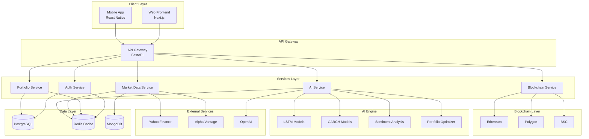

# Architecture Documentation

## Table of Contents

- [System Overview](#system-overview)
- [High-Level Architecture](#high-level-architecture)
- [Component Details](#component-details)
- [Data Flow](#data-flow)
- [Technology Stack](#technology-stack)
- [Module Mapping](#module-mapping)

## System Overview

QuantumNest is a modern microservices-based platform built using:

- **Frontend**: Next.js, React, TypeScript, TailwindCSS
- **Backend**: FastAPI, Python 3.8+, PostgreSQL, Redis
- **Blockchain**: Solidity, Ethereum, Polygon, BSC
- **AI/ML**: TensorFlow, PyTorch, scikit-learn
- **Infrastructure**: Docker, Kubernetes, Terraform

## High-Level Architecture



## Component Details

### 1. Frontend Layer

#### Web Frontend

- **Location**: `web-frontend/`
- **Technology**: Next.js 13, TypeScript, TailwindCSS
- **Key Files**:
    - `src/app/page.tsx` - Landing page
    - `src/app/dashboard/page.tsx` - User dashboard
    - `src/app/portfolio/page.tsx` - Portfolio management
    - `src/app/market-analysis/page.tsx` - Market data visualization
- **Features**:
    - Server-side rendering (SSR)
    - Static site generation (SSG)
    - Real-time updates via WebSocket
    - Responsive design
    - Web3 wallet integration

#### Mobile Frontend

- **Location**: `mobile-frontend/`
- **Technology**: React Native, Expo
- **Key Files**:
    - `src/app/dashboard/` - Dashboard screens
    - `src/app/portfolio/` - Portfolio screens
    - `src/components/` - Reusable components
- **Features**:
    - Native iOS and Android support
    - Biometric authentication
    - Push notifications
    - Offline mode

### 2. Backend Layer

#### FastAPI Application

- **Location**: `code/backend/`
- **Entry Point**: `app/main.py`
- **Structure**:
    ```
    app/
    ├── main.py              # FastAPI app initialization
    ├── api/                 # API endpoints
    │   ├── users.py         # User management
    │   ├── portfolio.py     # Portfolio operations
    │   ├── market.py        # Market data
    │   ├── ai.py            # AI endpoints
    │   ├── blockchain.py    # Blockchain operations
    │   └── admin.py         # Admin functions
    ├── auth/                # Authentication
    ├── core/                # Core configuration
    ├── db/                  # Database
    ├── models/              # SQLAlchemy models
    ├── schemas/             # Pydantic schemas
    ├── services/            # Business logic
    ├── ai/                  # AI models
    ├── workers/             # Celery tasks
    └── middleware/          # Middleware
    ```

#### Key Services

**Authentication Service** (`app/auth/`)

- JWT token generation and validation
- Password hashing (bcrypt)
- Role-based access control (RBAC)
- 2FA support

**Portfolio Service** (`app/services/portfolio_service.py`)

- Portfolio CRUD operations
- Asset allocation tracking
- Performance calculation
- Risk metrics

**Market Data Service** (`app/services/market_service.py`)

- Real-time price feeds
- Historical data retrieval
- Technical indicators
- Data caching

**AI Service** (`app/ai/`)

- Model loading and inference
- Async task management
- Prediction caching
- Model versioning

### 3. AI Engine

#### LSTM Price Predictor

- **File**: `code/backend/app/ai/lstm_model.py`
- **Purpose**: Time series price prediction
- **Input**: Historical price data (60-day window)
- **Output**: 1-5 day price forecasts
- **Architecture**: 3-layer LSTM with dropout

#### Advanced LSTM

- **File**: `code/backend/app/ai/advanced_lstm_model.py`
- **Purpose**: Enhanced price prediction with attention
- **Features**: Attention mechanism, bidirectional layers
- **Accuracy**: ~85% (backtested)

#### GARCH Model

- **File**: `code/backend/app/ai/garch_model.py`
- **Purpose**: Volatility forecasting
- **Model**: GARCH(1,1)
- **Usage**: Risk assessment, option pricing

#### Portfolio Optimizer

- **File**: `code/backend/app/ai/portfolio_optimizer.py`
- **Algorithm**: Mean-variance optimization
- **Constraints**: Position limits, sector allocation
- **Objective**: Maximize Sharpe ratio

#### Sentiment Analyzer

- **File**: `code/backend/app/ai/sentiment_analyzer.py`
- **Models**: BERT, FinBERT
- **Sources**: News, Twitter, Reddit
- **Output**: Sentiment score (-1 to 1)

### 4. Blockchain Layer

#### Smart Contracts

**TokenizedAsset.sol**

- **Location**: `code/blockchain/contracts/TokenizedAsset.sol`
- **Type**: ERC-20 token
- **Features**:
    - Fractional ownership
    - Trading controls
    - Valuation updates
    - Fee management

**PortfolioManager.sol**

- **Location**: `code/blockchain/contracts/PortfolioManager.sol`
- **Purpose**: On-chain portfolio management
- **Features**:
    - Asset allocation
    - Rebalancing
    - Performance tracking

**TradingPlatform.sol**

- **Location**: `code/blockchain/contracts/TradingPlatform.sol`
- **Purpose**: Decentralized exchange
- **Features**:
    - Order matching
    - Liquidity pools
    - Fee distribution

### 5. Data Layer

#### PostgreSQL

- **Purpose**: Primary relational database
- **Tables**:
    - `users` - User accounts
    - `portfolios` - User portfolios
    - `assets` - Asset definitions
    - `portfolio_assets` - Portfolio holdings
    - `transactions` - Transaction history
    - `ai_models` - Model metadata
    - `ai_predictions` - Prediction results

#### Redis

- **Purpose**: Caching and message broker
- **Usage**:
    - Session storage
    - API response caching
    - Celery broker
    - Rate limiting
    - Real-time data

#### MongoDB (Optional)

- **Purpose**: Time-series market data
- **Collections**:
    - `market_data` - OHLCV data
    - `news_articles` - Sentiment sources
    - `social_media` - Social sentiment data

## Data Flow

### User Authentication Flow

```
1. User submits credentials
2. Backend validates against database
3. JWT token generated
4. Token returned to client
5. Client stores token (localStorage/secure storage)
6. Subsequent requests include token in Authorization header
7. Middleware validates token
8. Request proceeds to endpoint
```

### AI Prediction Flow

```
1. User requests prediction via API
2. Backend creates Celery task
3. Task queued in Redis
4. Celery worker picks up task
5. Worker loads AI model
6. Model performs inference
7. Results stored in database
8. Results returned via task status endpoint
9. Frontend polls for completion
10. Results displayed to user
```

### Portfolio Performance Flow

```
1. User views portfolio
2. Frontend requests portfolio data
3. Backend queries database for holdings
4. Backend fetches current prices (cached in Redis)
5. Backend calculates performance metrics
6. Results cached in Redis (5-minute TTL)
7. Data returned to frontend
8. Charts and metrics rendered
```

## Technology Stack

### Frontend Stack

| Technology    | Version | Purpose            |
| ------------- | ------- | ------------------ |
| Next.js       | 13+     | React framework    |
| TypeScript    | 5.0+    | Type safety        |
| TailwindCSS   | 3.0+    | Styling            |
| Redux Toolkit | 1.9+    | State management   |
| React Query   | 4.0+    | Data fetching      |
| D3.js         | 7.0+    | Data visualization |
| ethers.js     | 6.0+    | Web3 integration   |

### Backend Stack

| Technology | Version | Purpose         |
| ---------- | ------- | --------------- |
| Python     | 3.10+   | Runtime         |
| FastAPI    | 0.104+  | API framework   |
| SQLAlchemy | 2.0+    | ORM             |
| Pydantic   | 2.0+    | Data validation |
| PostgreSQL | 14+     | Database        |
| Redis      | 6.0+    | Cache/broker    |
| Celery     | 5.3+    | Task queue      |

### AI/ML Stack

| Technology   | Version | Purpose             |
| ------------ | ------- | ------------------- |
| TensorFlow   | 2.13+   | Deep learning       |
| PyTorch      | 2.2+    | Deep learning       |
| scikit-learn | 1.3+    | ML algorithms       |
| pandas       | 2.1+    | Data manipulation   |
| numpy        | 1.24+   | Numerical computing |

### Blockchain Stack

| Technology   | Version | Purpose                |
| ------------ | ------- | ---------------------- |
| Solidity     | 0.8.0+  | Smart contracts        |
| Hardhat      | 2.0+    | Development framework  |
| ethers.js    | 6.0+    | Blockchain interaction |
| OpenZeppelin | 5.0+    | Contract libraries     |

## Module Mapping

### Backend API Modules

| Module               | File Path                    | Purpose               | Dependencies            |
| -------------------- | ---------------------------- | --------------------- | ----------------------- |
| **Main Application** | `app/main.py`                | FastAPI app setup     | FastAPI, routers        |
| **User Management**  | `app/api/users.py`           | User CRUD, auth       | SQLAlchemy, bcrypt      |
| **Portfolio API**    | `app/api/portfolio.py`       | Portfolio operations  | models, schemas         |
| **Market Data**      | `app/api/market.py`          | Market data endpoints | yfinance, alpha_vantage |
| **AI Endpoints**     | `app/api/ai.py`              | AI task management    | Celery, ai modules      |
| **Blockchain**       | `app/api/blockchain.py`      | Blockchain operations | web3, contracts         |
| **Authentication**   | `app/auth/authentication.py` | JWT handling          | jose, passlib           |
| **Database**         | `app/db/database.py`         | DB connection         | SQLAlchemy              |
| **Models**           | `app/models/models.py`       | ORM models            | SQLAlchemy              |
| **Schemas**          | `app/schemas/schemas.py`     | Pydantic schemas      | Pydantic                |

### AI Module Mapping

| AI Module               | File                            | Input                | Output                | Model Type       |
| ----------------------- | ------------------------------- | -------------------- | --------------------- | ---------------- |
| **LSTM Predictor**      | `app/ai/lstm_model.py`          | Price history (60d)  | Price forecast (1-5d) | RNN              |
| **GARCH Model**         | `app/ai/garch_model.py`         | Returns history      | Volatility forecast   | Statistical      |
| **Sentiment Analyzer**  | `app/ai/sentiment_analyzer.py`  | Text data            | Sentiment score       | Transformer      |
| **Portfolio Optimizer** | `app/ai/portfolio_optimizer.py` | Returns, constraints | Optimal weights       | Optimization     |
| **Anomaly Detector**    | `app/ai/anomaly_detection.py`   | Time series          | Anomaly flags         | Isolation Forest |
| **Risk Profiler**       | `app/ai/risk_profiler.py`       | Portfolio data       | Risk metrics          | Statistical      |

### Smart Contract Mapping

| Contract             | File                   | Functions                              | Events                              |
| -------------------- | ---------------------- | -------------------------------------- | ----------------------------------- |
| **TokenizedAsset**   | `TokenizedAsset.sol`   | mint, burn, transfer, updateAssetValue | AssetRevalued, TradingStatusChanged |
| **PortfolioManager** | `PortfolioManager.sol` | createPortfolio, addAsset, rebalance   | PortfolioCreated, AssetAdded        |
| **TradingPlatform**  | `TradingPlatform.sol`  | createOrder, executeOrder, cancelOrder | OrderCreated, OrderExecuted         |
| **DeFiIntegration**  | `DeFiIntegration.sol`  | stake, unstake, claimRewards           | Staked, Unstaked, RewardsClaimed    |

## Deployment Architecture

```
                    [Load Balancer]
                           |
        +-----------------+-------------------+
        |                 |                   |
   [Frontend 1]     [Frontend 2]        [Frontend 3]
        |                 |                   |
        +--------[API Gateway (NGINX)]---------+
                           |
        +-----------------+-------------------+
        |                 |                   |
   [Backend 1]       [Backend 2]        [Backend 3]
        |                 |                   |
        +-----------------+-------------------+
                           |
        +-----------------+-------------------+
        |                 |                   |
   [PostgreSQL]       [Redis]            [MongoDB]
   [Primary+Replica]  [Cluster]          [Cluster]
```

## Security Architecture

- **Network Layer**: Firewall, VPC, Security Groups
- **Application Layer**: Rate limiting, CORS, CSRF protection
- **Data Layer**: Encryption at rest, SSL/TLS
- **Authentication**: JWT, OAuth2, 2FA
- **Authorization**: RBAC, API keys
- **Monitoring**: Sentry, Prometheus, Grafana

---

**See Also:**

- [Installation Guide](INSTALLATION.md)
- [Configuration Guide](CONFIGURATION.md)
- [API Reference](API.md)
